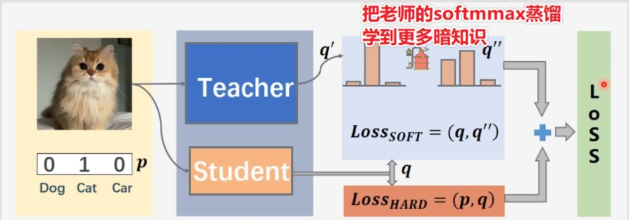

# 项目介绍
---
## 1。使用minin数据集，有teacher model, student model


#核心使用 loss

target label one-hot
###teacher 
先训练模块，使用softmax

###student model
通过训练好的teacher模块， 送入网络，对于老师的outputs，使用 softmax_t
t就是使用蒸馏，对于softmmax的值 进行一个 x = x/t

然后 student模块预测值有

```python

loss = distillation(output, target, teacher_output, temp=5.0, alpha=0.7)
```
使用了 teacher model 的预测值进行softmax_t和 target计算损失
和 student model 预测值进行 softmax_t 和 target 计算损失

之后在使用单独使用学生模块进行训练，学生模块

---
<br>

student的模块更加轻量

loss = student+ teacher loss 进行处理





```python 


def distillation(y, labels, teacher_scores, temp, alpha):
    """
    y: student model output predicts, no softmmax
    labels: True label 
    teacher_scores: teacher model outputs predicts, no softmax
    temp: temperature
    alph: weights 

    targets: use KLD calculates students model and teacher model softmax_temp, multiplicate students
    model no softmmax predicts 
    """
    return nn.KLDivLoss()(F.log_softmax(y / temp, dim=1), F.softmax(teacher_scores / temp, dim=1)) * (
            temp * temp * 2.0 * alpha) + F.cross_entropy(y, labels) * (1. - alpha)

```